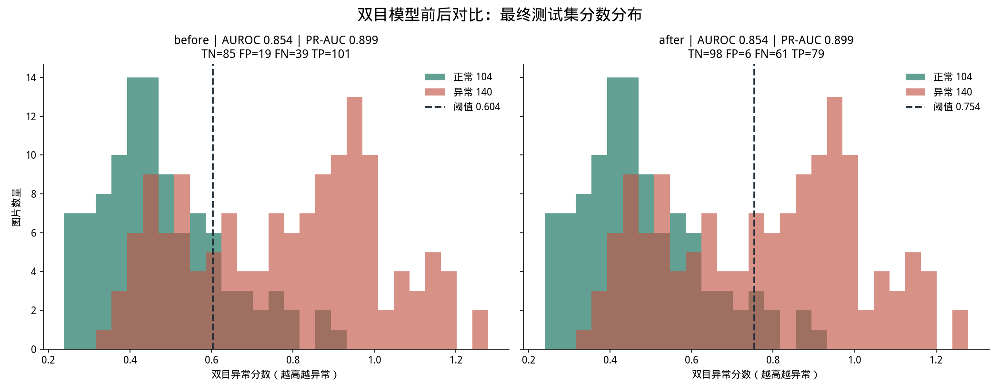

# SimpleNet 镜头脏污检测

基于 [SimpleNet](https://openaccess.thecvf.com/content/CVPR2023/papers/Liu_SimpleNet_A_Simple_Network_for_Image_Anomaly_Detection_and_Localization_CVPR_2023_paper.pdf)（CVPR 2023）的**无监督镜头脏污/遮挡检测**。

只做**场景级二分类**：判断镜头画面是否「脏污 / 被遮挡」，不定位具体位置与类型。训练只用正常（干净）样本。

---

## 一、功能

| 脚本 | 作用 |
|---|---|
| `run_lens.sh` | 训练（无监督，只学正常样本） |
| `visualize.py` | 抽样可视化，图片上标注「正常/脏污」+ 分数 |
| `test_folder.py` | 批量测试一个图片文件夹，输出标注图 + 统计 |
| `realtime_demo.py` | 实时逐帧演示（OpenCV 窗口，按 q 退出） |
| `test_report.py` | 生成分类测试统计图（混淆矩阵 + 指标 + 分数分布） |
| `analyze_errors.py` | 客观定位误检样本（按场景/光照分组统计 + 复制误检图） |

---

## 二、环境

- Python **3.8**
- PyTorch **2.3.1 + cu121**（RTX 40 系列需 torch ≥ 2.0）
- GPU 显存要求低（batch_size=4、输入 224×224，实测峰值内存约 5GB）

安装：

```bash
# 1. 创建虚拟环境（任选其一）
python3.8 -m venv venv
# 或用 uv:  uv venv --python 3.8 venv

# 2. 安装 torch（CUDA 12.1）
./venv/bin/pip install torch==2.3.1+cu121 torchvision==0.18.1+cu121 \
  --extra-index-url https://download.pytorch.org/whl/cu121

# 3. 安装其余依赖
./venv/bin/pip install -r requirements.txt
```

---

## 三、数据集准备

数据集放在项目根目录的 `data/` 下，结构如下（正样本=正常，负样本=脏污/遮挡）：

```
data/
  正样本/                          # 正常（干净）图
    <场景>/<光照>/<data_x>/<时间戳>/cam0/*.jpg
  负样本/                          # 脏污/遮挡图
    <场景>/<光照>/<脏污类型>/<程度>/<data_x>/<时间戳>/cam0/*.jpg
```

- 只使用 `cam0` 目录下的 RGB 图片（忽略 cam1 / depth / tof）。
- 每个 `cam0` 目录 = 一个录制片段，训练/测试按**片段**切分（7:3），避免数据泄漏。

> 数据路径可通过环境变量覆盖：`DATAPATH=/path/to/data bash run_lens.sh`；各 Python 脚本用 `--datapath` 指定。

---

## 四、训练

```bash
bash run_lens.sh
```

- 训练输出到 `results/`，checkpoint 保存 AUROC 最高的 epoch。
- 终端实时显示 tqdm 进度条。

---

## 五、推理 / 可视化

```bash
# 1. 抽样可视化
./venv/bin/python visualize.py --n 8

# 2. 批量测试文件夹
./venv/bin/python test_folder.py --input ./data/负样本/.../cam0

# 3. 实时逐帧演示
./venv/bin/python realtime_demo.py --input ./data/负样本/.../cam0 --fps 15

# 4. 生成分类统计图
./venv/bin/python test_report.py

# 5. 误检分析
./venv/bin/python analyze_errors.py
```

---

## 六、测试结果（详见 `测试报告.md`）

| 指标 | 值 |
|---|---|
| 图像级 AUROC | **0.741** |
| 准确率 / 精确率 / 召回率 / F1 | 0.705 / 0.744 / 0.625 / 0.679 |

误检主要集中在**极端光照**场景（光照不良 49.5%、强光 34.5%、关灯 35%），正常光照误检率仅 0~15%。

---

## 七、目录结构

```
.
├── main.py              # 训练入口
├── simplenet.py         # SimpleNet 模型（含内存优化）
├── backbones.py / resnet.py / common.py / metrics.py / utils.py
├── datasets/
│   └── lens_dirt.py     # 自定义数据集适配（按片段切分、去冗余）
├── run_lens.sh          # 训练脚本
├── visualize.py / test_folder.py / realtime_demo.py / test_report.py / analyze_errors.py
├── requirements.txt
└── 测试报告.md
```

---

## 致谢

- [SimpleNet (CVPR 2023)](https://github.com/DonaldRR/SimpleNet)
- 本项目在其基础上适配自定义数据集并做内存优化（跳过像素级特征插值，避免 OOM）。

## 测试报告预览



